# 主流程与各模块说明（含流程图）

本文描述从 `main.py` 入口到 **数据存储工程化 → 因子清洗与行业内标准化 → 数据质量 → IC（含驱动融合列权）→ 因子诊断（Top-K 多头超额 + 分组收益单调性）→ 多因子权重建议 → 样本外验证与因子失效监控 → 因子入选与剔除 → 因子相关性与冗余分析 → 因子分层与复合因子 → 回测（因子 Top-K → 等权 / 夏普 / 风险平价配权）→ 风格层暴露与收益关联 → 基准与超额收益 → 换手与成本 → 风险暴露与集中度 → 绩效与落盘** 的顺序，以及各目录模块在流程中的位置与职责。与 [INTERFACE_AND_CONTRACTS.md](./INTERFACE_AND_CONTRACTS.md) 互补。**下文主体是 MVP 研究回测主流程**；`storage.database` 已作为本地 SQLite 基础数据层，先定义行情、财务、因子、公告、新闻和股票池快照表；`live.order_builder`、`live.drawdown_control`、`live.capacity_impact`、`live.order_precheck`、`live.risk_gate`、`live.risk_limits`、`live.stress_test`、`live.risk_control_report`、`live.paper_trading`、`live.broker`、`live.account_state`、`live.paper_runner`、`live.paper_report`、`live.factor_health_report`、`live.style_exposure_monitor`、`live.manual_confirmation`、`live.execution_feedback`、`live.paper_guard`、`live.paper_run_control`、`live.paper_scheduler`、`live.live_sop` 与 `scripts/run_daily_paper.py` / `scripts/run_scheduled_daily_paper.py` / `scripts/build_unified_risk_gate.py` / `scripts/build_drawdown_control.py` / `scripts/build_capacity_impact.py` / `scripts/build_portfolio_risk_limits.py` / `scripts/build_portfolio_stress_tests.py` / `scripts/build_execution_feedback.py` / `scripts/build_live_sop.py` 已作为准实盘准备层，用于把目标权重转换成订单计划、合并公告 / 舆情 / 人工黑名单风险门禁、检查账户级回撤止损与降仓、估算订单容量与冲击成本、检查组合层统一风险限额、做组合压力测试、汇总风险总控日报、检查可执行性、用虚拟账户或模拟券商验证成交协议、保存纸面账户状态、生成带因子健康、增强因子健康总览、风格暴露、回撤控制、容量冲击、风险限额、压力测试和总控结论的日报和人工确认单、回填真实成交并分析执行偏差、检查异常、保护交易日运行和重复写入，提供可交给系统调度器的单次运行入口，并生成小资金实盘每日 SOP；日终纸面交易已可通过 `--execution-mode simulated_broker` 走统一券商接口，`RealBrokerReadOnlyAdapter` 已提供真实券商只读骨架，但尚未接入真实交易 API。

---

## 1. 总流程图（Mermaid）

```mermaid
flowchart TB
    subgraph data["数据层"]
        DB["storage/database<br/>SQLite: prices/fina/factors/events/news/universe"]
        CSV["data/prices_demo.csv（可选）"]
        POOL["live/stock_pool<br/>Excel / CSV 股票池"]
        CACHE["data/prices_tushare_cache.csv<br/>Tushare 本地缓存"]
        EVENTS["data/announcement_events.csv<br/>公告事件表（可选）"]
        TS["live/data_feed<br/>Tushare / 合成兜底"]
        DB -. 后续导出缓存 .-> CACHE
        CSV --> LONG["长表 long_df"]
        CACHE --> LONG
        POOL --> TS
        TS --> LONG
        LONG --> WIDE["宽表 prices<br/>backtest_utils.long_to_wide"]
    end

    subgraph panel["因子层"]
        WIDE --> FB["factors/panel_builder<br/>build_four_factor_panel"]
        LONG --> FB
        EVENTS --> FB
        FB --> BASEPANEL["基础因子面板<br/>量价 / 估值 / 质量 / 成长 / 现金流 / 公告事件"]
        BASEPANEL --> ML["factors/factor_ml<br/>滚动训练 ML_SCORE"]
        WIDE --> ML
        ML --> PANEL["原始因子面板 panel<br/>基础因子 + ML_SCORE"]
        LONG --> IND["行业字段<br/>股票池 子行业/分类 或 industry_col"]
        PANEL --> PREPMAIN["factors/preprocess<br/>行业内 winsorize + z-score<br/>小行业回退全截面"]
        IND --> PREPMAIN
        PREPMAIN --> RPANEL["研究面板 research_panel<br/>IC/诊断/回测使用"]
    end

    subgraph cache["落盘（可选）"]
        PANEL --> CI["live/cache_io.save_run_cache<br/>行情/原始面板 CSV"]
        RPANEL --> CI2["factor_panel_zscore.csv"]
    end

    subgraph dq["数据质量（可选落盘）"]
        WIDE --> DQ["analysis/data_quality<br/>价格/因子/调仓日覆盖率"]
        PANEL --> DQ
        DQ --> DQOUT["output/data_quality/*.csv<br/>factor_coverage.png"]
    end

    subgraph ic_block["IC：单因子评价 + 融合列权输入"]
        RPANEL --> IC["analysis/ic.daily_ic_spearman<br/>截面 Spearman vs 前瞻收益"]
        WIDE --> IC
        IC --> ICSUM["summarize_ic + IC 分布/滚动稳定性<br/>可选写 ic_*.csv / ic_diagnostics/*.csv"]
    end

    subgraph diag["因子诊断"]
        RPANEL --> LEX["analysis/factor_diagnostics<br/>Top-K 等权多头腿"]
        WIDE --> LEX
        LEX --> LEXOUT["output/factor_diagnostics<br/>long_excess_summary.csv"]
        RPANEL --> GRP["analysis/factor_diagnostics<br/>分组收益 / 单调性"]
        WIDE --> GRP
        GRP --> GRPOUT["group_return_detail.csv<br/>group_return_summary.csv"]
        IC --> FW["models/factor_weighting<br/>全样本综合因子评分 / 权重建议"]
        GRP --> FW
        FW --> FWOUT["factor_weight_summary.csv"]
        IC --> FWTRAIN["训练段综合因子评分<br/>train_ratio 切分"]
        GRP --> FWTRAIN
        FWTRAIN --> FWTRAINOUT["factor_weight_train_summary.csv"]
        IC --> FWROLL["调仓日前滚动综合权重<br/>lookback / min_days / 平滑"]
        GRP --> FWROLL
        FWROLL --> FWROLLOUT["rolling_factor_weight_log.csv"]
        FWROLL --> FWSTAB["analysis/factor_weight_stability<br/>权重稳定性 / 漂移事件 / 主导因子"]
        FWSTAB --> FWSTABOUT["factor_weight_stability_summary.csv<br/>factor_weight_drift_events.csv<br/>factor_weight_portfolio_drift.csv"]
        RPANEL --> OOS["analysis/factor_validation<br/>训练段 vs 样本外验证"]
        WIDE --> OOS
        OOS --> OOSOUT["output/factor_validation<br/>out_of_sample_validation.csv<br/>factor_decay_monitor.csv<br/>rolling_out_of_sample_*.csv"]
        DQ --> FSEL["analysis/factor_selection<br/>PASS / WATCH / REJECT"]
        FW --> FSEL
        OOS --> FSEL
        FSEL --> FSELOUT["factor_selection_summary.csv"]
        RPANEL --> FRED["analysis/factor_redundancy<br/>每日横截面相关性 / 冗余报告"]
        FSEL --> FRED
        FRED --> FREDOUT["factor_correlation_matrix.csv<br/>factor_redundancy_report.csv"]
        RPANEL --> FCOMP["analysis/factor_composite<br/>风格分层 / 复合因子"]
        FRED --> FCOMP
        FCOMP --> FCOMPOUT["factor_composite_scores.csv<br/>factor_composite_components.csv"]
    end

    subgraph fusion["融合得分（FUSED_ZSCORE / SCORE_WEIGHTED / ROLLING_SCORE_WEIGHTED）"]
        FSEL --> FPASS["主融合候选池<br/>优先 PASS，无 PASS 回退 WATCH"]
        FRED --> FPASS
        FCOMP --> FPASS
        FPASS --> FZ
        FPASS --> FS
        FPASS --> FR
        RPANEL --> FZ["models/fusion<br/>fuse_ic_weighted 或等权 z-score"]
        IC --> FZ
        FZ --> FUSED["融合 PanelLong"]
        RPANEL --> FS["models/fusion<br/>fuse_static_weight_zscore"]
        FWTRAIN --> FS
        FS --> FUSED_SW["训练段权重固定<br/>验证段 PanelLong"]
        RPANEL --> FR["main<br/>调仓日前滚动权重融合"]
        FWROLL --> FR
        FR --> FUSED_RW["滚动综合权重<br/>调仓日 PanelLong"]
    end

    subgraph bt["回测层（每个因子 / 融合各跑一条）"]
        RPANEL --> BT["backtest/backtest_single<br/>或 backtest_multi"]
        FUSED --> BT
        FUSED_SW --> BT
        FUSED_RW --> BT
        WIDE --> BT
        BT --> RB{"月末 ME<br/>再平衡日?"}
        RB -->|否| NAV1["按昨持仓估值 → 记净值"]
        RB -->|是| SORT["因子截面排序<br/>有效价 / 有效因子"]
        SORT --> LIQ["可交易性过滤<br/>均量 / 均额"]
        LIQ --> TOPK["取 top_k 只股票"]
        TOPK --> WMODE{"config.portfolio_weighting"}
        WMODE -->|equal| EQ["目标 1/K"]
        WMODE -->|max_sharpe| EST["_estimate_mu_cov_for_picks<br/>→ μ、Σ → maximize_sharpe"]
        EST --> MS["models/optimizer.maximize_sharpe"]
        WMODE -->|risk_parity| EST2["_estimate_mu_cov_for_picks<br/>→ 仅用 Σ → risk_parity"]
        EST2 --> RP["models/optimizer.risk_parity"]
        MS --> IND["行业权重上限<br/>max_industry_weight"]
        RP --> IND
        EQ --> IND
        IND --> VT["波动率目标<br/>超目标则降仓位留现金"]
        VT --> MP["最小持仓数量<br/>不足则降仓位留现金"]
        MP --> TSF["交易状态约束<br/>停牌 / 涨停买入 / 跌停卖出"]
        TSF --> TW["_rebalance_to_target_weights"]
        TW --> NAV2["先卖后买、扣手续费<br/>更新 shares/cash"]
        NAV1 --> RB
        NAV2 --> RB
    end

    subgraph out["输出"]
        BT --> PERF["analysis/performance.summarize<br/>年化收益/波动/夏普/回撤"]
        WIDE --> BENCH["analysis/benchmark<br/>股票池等权基准"]
        NAVC --> BENCH
        BENCH --> EXCESS["超额收益 / 跟踪误差 / 信息比率"]
        EXCESS --> PERF
        BENCH --> REGIME["analysis/market_regime<br/>BULL / BEAR / SIDEWAYS"]
        NAVC --> REGIME
        REGIME --> REGIMEOUT["output/market_regime<br/>strategy_regime_*.csv"]
        BT --> META["meta：调仓记录 rebalance_log<br/>每期 top_k 股票及权重"]
        META --> TO["analysis/turnover<br/>换手率 / 预估交易成本"]
        TO --> PERF
        META --> RISK["analysis/risk_exposure<br/>HHI / effective_n / Top权重"]
        RISK --> PERF
        META --> STYLE["analysis/style_exposure<br/>风格层暴露 / 下一期收益关联"]
        FCOMPOUT --> STYLE
        NAVC --> STYLE
        STYLE --> EXP
        PERF --> EXP["live/cache_io<br/>performance_summary / run_config / rebalance_logs"]
        META --> EXP
        TO --> EXP
        RISK --> EXP
        BT --> NAVC["main 收集 nav_curves"]
        NAVC --> PLOT["analysis/plotting.plot_nav<br/>nav_compare.png"]
        EXCESS --> XPLOT["plot_nav<br/>excess_nav_compare.png"]
        TO --> TPLOT["plot_turnover<br/>turnover_compare.png"]
        RISK --> RPLOT["plot_effective_n<br/>risk_exposure/effective_n_compare.png"]
        IC --> ICFIG["plot_ic（persist 时）<br/>ic_compare / ic_timeseries_*"]
        BT --> WFIG["plot_weights（persist 时）<br/>weights_*"]
    end

    subgraph liveprep["准实盘准备层"]
        META --> TARGET["最近一期目标权重<br/>rebalance_log picks/weights"]
        TARGET --> SCHED["scripts/run_scheduled_daily_paper.py<br/>调度入口 + 日志"]
        TARGET --> SCRIPT["scripts/run_daily_paper.py<br/>读取目标权重 + 最新价格"]
        SCHED --> SCRIPT
        SCRIPT --> CONTROL["live/paper_run_control<br/>交易日日历 / 重复运行保护"]
        CONTROL --> DD["live/drawdown_control<br/>回撤止损与降仓 PASS / WATCH / BLOCK / NA"]
        DD --> GUARD["live/paper_guard<br/>输入 / 结果异常检查"]
        GUARD --> RUNNER["live/paper_runner<br/>单日纸面交易运行器"]
        RUNNER --> OB["live/order_builder<br/>目标权重 + 当前持仓 + 最新价格"]
        OB --> ORDERS["订单计划<br/>BUY / SELL / shares / amount / reason"]
        ORDERS --> ORDERCSV["live/cache_io.save_order_plans<br/>output/order_plans/*.csv"]
        ORDERS --> CAPACITY["live/capacity_impact<br/>参与率 / 冲击成本 PASS / WATCH / BLOCK / NA"]
        CAPACITY --> CAPCSV["daily_capacity_impact_*.csv"]
        RISKDATA["公告风险候选 + 负面舆情候选 + 人工黑名单"] --> RGATE["live/risk_gate<br/>统一风险门禁 PASS / WATCH / BLOCK"]
        RGATE --> RBLACK["risk_blacklist_<date>.csv"]
        RBLACK --> OPC
        ORDERS --> OPC["live/order_precheck<br/>现金 / 可卖数量 / 手数 / 停牌涨跌停"]
        OPC --> CHECKS["订单检查结果<br/>PASS / BLOCK / reason"]
        CHECKS --> CHECKCSV["live/cache_io.save_order_checks<br/>output/order_checks/*.csv"]
        DD --> RLIMITS["live/risk_limits<br/>组合风险限额 PASS / WATCH / BLOCK / NA"]
        RGATE --> RLIMITS
        CHECKS --> RLIMITS
        RLIMITS --> RLIMITCSV["portfolio_risk_limit_checks_<date>.csv"]
        DD --> STRESS["live/stress_test<br/>组合压力测试 PASS / WATCH / BLOCK / NA"]
        STRESS --> STRESSCSV["daily_stress_tests_<date>.csv"]
        GUARD --> RCONTROL["live/risk_control_report<br/>风险总控日报 BLOCK / WATCH / NA / PASS"]
        RGATE --> RCONTROL
        RBLACK --> RCONTROL
        DD --> RCONTROL
        CAPACITY --> RCONTROL
        CHECKS --> RCONTROL
        RLIMITS --> RCONTROL
        STRESS --> RCONTROL
        RCONTROL --> RCONTROLCSV["daily_risk_control_report_<date>.csv"]
        CHECKS --> CONFIRM["live/manual_confirmation<br/>小资金人工确认单"]
        CONFIRM --> CONFIRMCSV["output/live_orders/<strategy><br/><date>_manual_confirm.csv / .md"]
        CONFIRM --> FEEDBACK["live/execution_feedback<br/>真实成交回填 / 执行偏差"]
        FEEDBACK --> FEEDBACKCSV["output/execution_feedback/<strategy><br/>*_execution_feedback.csv / .md"]
        CHECKS --> MODE{"execution_mode"}
        MODE --> BROKER["live/broker<br/>统一券商接口 / SimulatedBroker"]
        BROKER --> BORDER["统一订单回报<br/>FILLED / REJECTED / CANCELLED"]
        BORDER --> PTRADES
        MODE --> PAPER["live/paper_trading<br/>虚拟账户模拟成交"]
        PAPER --> PTRADES["成交 / 跳过日志<br/>FILLED / SKIPPED / cash / position"]
        PTRADES --> PTRADESCVS["live/cache_io.save_paper_trades<br/>output/paper_trades/*.csv"]
        PTRADES --> ASTATE["live/account_state<br/>保存现金 / 持仓 / 快照"]
        ASTATE --> ACSV["output/paper_account/<strategy><br/>account / positions / snapshots"]
        ASTATE --> RUNNER
        RUNNER --> GUARD
        STYLECSV["output/factor_diagnostics<br/>style_exposure.csv"] --> STYLEMON["live/style_exposure_monitor<br/>最近一期目标组合风格暴露"]
        STYLEMON --> REPORT
        HEALTHCSV["factor_validation / factor_diagnostics / market_regime<br/>诊断 CSV"] --> HEALTHMON["live/factor_health_report<br/>增强因子健康总览"]
        HEALTHMON --> REPORT
        DD --> REPORT
        CAPACITY --> REPORT
        RLIMITS --> REPORT
        STRESS --> REPORT
        RCONTROL --> REPORT
        RUNNER --> REPORT["live/paper_report<br/>Markdown 纸面交易日报"]
        REPORT --> REPORTCSV["output/paper_reports/<strategy>/<date>.md"]
        SCHED --> SLOG["output/scheduler_logs/<date>.log"]
        CHECKLIST["live/semi_auto_checklist<br/>半自动执行决策"] --> SOP["live/live_sop<br/>小资金实盘每日 SOP"]
        SCRIPT --> SOP
        RCONTROL --> SOP
        FEEDBACK --> SOP
        SOP --> SOPCSV["output/live_sop/<strategy>/<date>_daily_sop.csv/.md"]
    end
```

夏普 / 风险平价在样本不足或外层异常时该期回退 **等权**（与下文第 3 节、`rebalance_log[].weighting` 一致）；`risk_parity` 优化器内部失败时回退逆波动率，仍记 `risk_parity`。若 `Settings.max_position_weight` 可行且触发裁剪，标签会追加 `_capped`；若 `Settings.max_industry_weight` 在 `(0, 1)`，目标权重会先限制单个行业暴露；若 `Settings.target_volatility > 0`，回测会用历史协方差估算组合年化波动，超目标时降低股票仓位并保留现金；若 `Settings.min_positions > 0` 且有效目标持仓数不足，会把股票总仓位缩到 `min_positions_exposure`；若 `Settings.max_rebalance_turnover` 触发调仓节流，标签会追加 `_turnover_capped`。若配置了 `Settings.min_avg_volume` / `min_avg_amount`，Top-K 前会先做可交易性过滤，并把过滤前后候选数写入 `rebalance_log`；若开启 `enable_trade_status_filter`，停牌 / 涨停 / 跌停约束会在撮合前调整目标权重；逐股票的入选、过滤、行业调整、波动率缩放、最小持仓缩放、交易阻断和节流原因写入 `decision_log`。**融合路径**：默认用 **滞后滚动 IC 均值** 对 z-score 后各因子列加权（见 `fuse_ic_weighted_zscore`）；IC **不**进入 Top-K 内 `maximize_sharpe` / `risk_parity` 的 μ、Σ。

---

## 2. 按执行顺序说明（与 `main()` 大致一致）

| 顺序 | 位置 | 做什么 | 意义 |
|------|------|--------|------|
| 0 | `storage.database` / `storage.warehouse` / `storage.price_adjustment` / `storage.inspection` / `scripts/init_database.py` / `scripts/update_database_cache.py` / `scripts/build_database_quality_report.py` | 初始化本地 SQLite 表结构；把行情、财务和因子面板按主键 upsert 到数据库；行情支持 `adj_factor/adj_close`，再导出 `output/cache/prices_long.csv`、交易口径 `prices_wide_close.csv`、研究口径 `prices_wide_adj_close.csv`、`factor_panel.csv`；生成数据库巡检日报 | 把长期基础数据和一次性实验输出分开，同时区分真实交易价格和研究复权价格，用缓存导出兼容现有 `main.py` 和日终纸面交易，并在每日运行前检查数据是否可用 |
| 1 | `config.get_settings()` | 读路径、区间、`top_k`、费率、`portfolio_weighting`、IC 前瞻天数等 | 集中参数，避免魔法数 |
| 2 | `live/stock_pool` + `live/data_feed` + `backtest_utils` | 优先本地 demo / Tushare 缓存；否则从 Excel/CSV 股票池读取标的并拉取 Tushare 日线和 `adj_factor`，得到 `long_df`、研究口径 `research_prices`（优先 `adj_close`）和交易口径 `execution_prices`（`close`） | 摆脱默认示例股票池，统一真实股票池、行情缓存与回测数据形态，同时把研究收益口径和真实交易口径拆开 |
| 3 | `factors/panel_builder` | 计算动量、长动量、短反转、低波、成交量放大、PE、ROE、毛利率、净利率、低资产负债率、营收增长、利润增长、自由现金流收益率代理、经营现金流质量、公告事件得分等基础列 | **Alpha/打分**：谁相对更值得持有（仅使用 ≤当日 信息） |
| 3A | `factors/factor_events` | 从本地公告事件表生成 `ANNOUNCEMENT_EVENT_SCORE`，按公告日向后衰减；也可用 `calc_announcement_event_type_scores` 拆出回购、减持、问询处罚、分红、合同项目等类型分层因子 | 把公告、事件、风险提示先结构化成可检验因子，并区分收益候选和风险过滤输入，不把工程绑定死在某个新闻源 |
| 4 | `factors/factor_ml` | 用基础因子作为特征、未来收益作为标签，按时间滚动训练梯度提升类模型并追加 `ML_SCORE` | 把机器学习作为候选因子，而不是直接替代策略；训练样本只使用预测日前可观察到完整标签的历史数据 |
| 5 | `analysis/data_quality` | 统计价格覆盖、因子覆盖、调仓日有效截面 | 判断结果是否建立在足够样本上 |
| 6 | `factors/preprocess` + `live/cache_io.save_run_cache`（可选） | 生成横截面标准化因子面板，并写 `output/cache/*.csv`；`prices_wide_close.csv` 保留交易价格，`prices_wide_adj_close.csv` 保留研究价格 | 复现与离线分析；多因子融合使用统一 z-score 口径，同时避免纸面交易误用复权合成价 |
| 7 | `analysis/ic` | 每个交易日：因子 vs **前瞻**收益的截面 Spearman；汇总 mean_IC、分位数、正负占比与滚动稳定性 | **因子评价**；并作为 **融合列权** 输入（滞后 rolling，见 `fuse_ic_weighted_zscore`） |
| 8 | `analysis/factor_diagnostics` | 对每个因子构造 Top-K 等权多头腿；同时按因子从低到高分组，计算每组持有期收益、Top-Bottom 与单调性 | 回答“高分组有没有主动收益”以及“全排序是否有收益层次”，介于 IC 与完整回测之间 |
| 9 | `models/factor_weighting` | 综合 IC、rolling IC、Top-Bottom 与单调性，生成 `factor_score` / `fusion_weight` 建议表；同时可在训练段和调仓日前历史窗口生成实际使用的权重 | 把因子评价结果转成可审计、可验证、可滚动更新的权重 |
| 9A | `analysis/factor_weight_stability` | 基于 `rolling_factor_weight_log.csv` 统计每个因子的权重稳定性、漂移事件、组合层主导因子和有效因子数量 | 判断滚动权重是在稳定适应市场，还是出现过快跳变或单一因子主导 |
| 10 | `analysis/factor_validation` | 把 IC、多头超额、Top-Bottom 与单调性按训练段 / 验证段拆开比较，并生成失效监控状态；同时按滚动训练 / 验证窗口生成 rolling OOS 明细和汇总 | 回答“训练期有效的因子，样本外是否还有效”，以及“这个有效性是否跨时间窗口稳定” |
| 10B | `analysis/multi_universe_validation` | 读取多个已完成回测 output 目录，汇总策略绩效和因子 Top-K 多头超额在不同股票池上的表现 | 回答“策略/因子是不是只在一个股票池里有效”，把单股票池验证扩展成横向稳健性验证 |
| 10C | `analysis/parameter_sensitivity` | 在同一份价格和因子缓存上一次只改一个参数，重新跑轻量回测并汇总明细与稳健性 | 回答“策略是不是只在某一个精确参数下好看”，避免参数过拟合 |
| 10D | `scripts/build_announcement_event_type_analysis.py` | 对公告类型分层因子计算覆盖率、IC、Top-K 多头超额、分组收益和建议标签 | 回答“哪类公告更像收益因子，哪类公告更像风险过滤输入”，避免把所有公告粗暴混成一个总分 |
| 10E | `scripts/build_announcement_event_type_backtest.py` | 比较不用公告、公告总分、公告类型收益因子、公告类型收益+风险混合等方案的滚动综合权重回测 | 回答“公告拆开以后，进入组合层是否比公告总分更有效”，并检验负面公告应进入收益融合还是风险过滤 |
| 10F | `scripts/build_announcement_event_type_risk_filter_backtest.py` | 将正向公告类型作为 alpha，负面公告类型作为调仓前候选股过滤，输出过滤日志和过滤前后回测对比 | 回答“负面公告作为风险门禁时是否真的改变候选股和组合表现”，把信息类风险从打分层拆到交易前风控层 |
| 11 | `analysis/factor_selection` | 汇总覆盖率、综合因子评分和样本外失效监控，生成 `PASS/WATCH/REJECT` 准入表 | 把“因子评价”变成“能否进入主融合”的交易层决策 |
| 12 | `analysis/factor_redundancy` | 计算每日横截面因子相关性均值，输出相关矩阵和高相关因子对，并在主融合候选池里剔除冗余因子 | 防止多个高度相似的因子重复进入主策略，把“因子多”变成“信息不重复” |
| 13 | `analysis/factor_composite` | 将准入 + 去冗余后的原始因子按量价、估值、质量、成长、现金流、ML 等风格层合成复合分数 | 让主融合从“原始因子堆叠”升级为“风格层融合”，提高解释性和监控性 |
| 14 | `models/fusion` + `main` | 默认 **`fuse_ic_weighted_zscore`**（可关回等权）得到 `FUSED_ZSCORE`；训练段静态综合权重得到 `FUSED_SCORE_WEIGHTED`；调仓日前滚动综合权重得到 `FUSED_ROLLING_SCORE_WEIGHTED`；主融合候选池优先使用复合风格层，缺失时回退去冗余原始因子池 | 三条融合路线并列对比：原 IC rolling、静态验证、滚动准实盘候选；弱因子和重复因子可保留诊断但不默认拖入主策略 |
| 15 | `backtest/backtest_single` | 逐日更新净值；在 **再平衡日** 用因子排序，先做可交易性 / 流动性过滤，再选 Top-K，并按 **等权**、**夏普** 或 **风险平价** 生成目标权重；之后经过单票权重上限、行业权重上限、波动率目标、最小持仓数量、单次换手上限；若开启交易状态约束，则限制停牌、涨停买入/加仓、跌停卖出/减仓；同步生成 `decision_log` | **模拟交易规则 + 决策审计**；先保证候选股票可交易，再控制股票/行业集中度、组合波动、最低分散度和换手，再判断目标交易是否可执行，并记录为什么买/卖/没买/买不了 |
| 16 | `analysis/style_exposure` | 由融合策略调仓日志、复合风格分数和净值曲线计算逐期风格暴露、暴露汇总与暴露-下一期收益关联 | 解释融合策略到底偏向量价、质量等哪类风格，并观察这些风格倾斜是否与后续收益有关 |
| 17 | `analysis/performance.summarize` | 由净值序列算年化收益、波动、**事后夏普**、最大回撤 | **成绩单**：描述这条净值曲线，与 `maximize_sharpe`（配权目标）不是同一对象 |
| 18 | `backtest.backtest_multi` | **`run_multi_backtest(fused=...)`** 对融合得分回测（内部 `run_single_backtest`） | 多因子组合策略的一条净值 |
| 19 | `analysis/benchmark` | 构造股票池等权基准，计算超额收益、跟踪误差、信息比率 | 判断策略收益来自 alpha，还是来自市场/股票池整体上涨 |
| 20 | `analysis/market_regime` | 用股票池等权基准识别 BULL / BEAR / SIDEWAYS，并统计每条策略分段收益、超额、回撤和状态 | 回答“策略到底适合什么市场环境”，避免只看总净值 |
| 21 | `analysis/turnover` | 由 `rebalance_log` 计算换手率、预估交易成本 | 判断收益是否依赖高频换仓，估算成本压力 |
| 22 | `analysis/risk_exposure` | 由 `rebalance_log` 计算 HHI、effective_n、Top 权重 | 判断持仓是否过度集中，补充组合风控视角 |
| 23 | `live/cache_io` 实验记录 | 写 `run_config.json`、`performance_summary.csv`、`factor_diagnostics/*.csv`、`factor_validation/*.csv`、`market_regime/*.csv`、`data_quality/*.csv`、`rebalance_logs/*.csv`、`decision_logs/*.csv`、`turnover_logs/*.csv`、`risk_exposure/*.csv` | 可复现、可对照、可审计 |
| 24 | `analysis/plotting.plot_nav` 等 | 净值 / 超额净值 / IC / 权重 / 换手 / 集中度 / 覆盖率图 | 可视化 |
| 23 | `live/order_builder` | 读取目标权重、当前持仓、最新价格、现金 / 总资产，按手数和最小订单金额生成订单计划 | 把研究层的“目标权重”转成准实盘层的“买卖多少股” |
| 23A | `live/risk_gate` / `scripts/build_unified_risk_gate.py` | 合并人工黑名单、公告风险候选和负面舆情候选，按 `BLOCK > WATCH > PASS` 输出统一门禁，并可导出 `risk_blacklist_<date>.csv` | 把信息类风险和人工风险收口到下单前统一风控入口，让订单预检查只消费一张风险表 |
| 23A-2 | `live/drawdown_control` / `scripts/build_drawdown_control.py` | 读取纸面账户历史快照、当前持仓估值和目标权重，按账户回撤阈值缩放目标仓位 | 从“目标组合想买多少”推进到“账户亏损状态下允许买多少” |
| 23A-3 | `live.capacity_impact` / `scripts/build_capacity_impact.py` | 读取订单计划和日频成交额历史，按过去 N 条记录计算平均成交额，估算订单参与率、冲击成本 bps、冲击成本金额和容量空间 | 从“订单能不能下”推进到“这笔订单相对市场成交额会不会太重，真实成交会不会明显侵蚀收益” |
| 23A-4 | `live/risk_limits` / `scripts/build_portfolio_risk_limits.py` | 读取目标权重、当前权重、行业映射、风险门禁和订单预检查结果，按统一限额表输出 `PASS/WATCH/BLOCK/NA` | 把分散的单票、行业、现金、分散度、换手、事件风险和订单风险收口到组合层总控表 |
| 23A-5 | `live/stress_test` / `scripts/build_portfolio_stress_tests.py` | 读取目标权重、行业映射和压力情景，估算市场下跌、单票下跌、前三大持仓下跌和行业下跌对组合的冲击 | 从“当前有没有超限”推进到“坏情况发生时组合会损失多少” |
| 23A-6 | `live.risk_control_report` | 汇总运行检查、统一风险门禁、风险黑名单、回撤、容量、订单预检查、风险限额和压力测试，按 `BLOCK > WATCH > NA > PASS` 输出当天总控状态 | 把分散的风控零件收口成一张日报，回答“今天是否允许继续自动或半自动执行” |
| 23A-7 | `live.version_freeze` / `scripts/build_live_version_freeze.py` | 记录策略名、股票池文件哈希、调仓频率、运行时间、价格口径、关键风控参数、Git commit 和源码哈希 | 小资金人工确认实盘前先固定观察期版本，避免后续复盘时解释不清策略、股票池或参数是否变化 |
| 23B | `live/order_precheck` | 对订单计划做现金、可卖数量、买入手数、最小订单金额、风险黑名单、停牌 / 涨跌停检查 | 在纸面交易或真实下单前拦截明显不可执行订单 |
| 24 | `live/broker` + `live/broker_factory` | 定义 `BrokerAdapter`、`SimulatedBroker`、`RealBrokerReadOnlyAdapter`，并按 `broker_mode/broker_provider` 创建对应 Adapter | 给纸面、模拟和未来真实券商一个共同接口；真实券商先用只读 adapter 验证查询能力，具体通道统一注册到 Factory |
| 25 | `live/paper_trading` | 只执行通过预检查的订单，按手续费更新虚拟现金和持仓，并记录成交 / 跳过原因 | 在不真实下单的前提下，验证订单执行后账户会如何变化 |
| 26 | `live/account_state` | 保存和读取纸面账户现金、持仓与每日快照 | 让纸面交易能跨天连续运行，而不是每次从初始资金重启 |
| 27 | `live/stock_pool` + `scripts/build_live_universe.py` | 从人工研究池、价格缓存和交易状态生成过滤报告与 `active_universe_<date>.csv` | 在券商接口前确认“今天系统允许在哪些股票里选”，避免直接拿人工池下单 |
| 28 | `live/paper_runner` | 读取账户状态，串联订单生成、预检查、执行模式选择、成交回报兼容、持仓更新、账户快照与 CSV 落盘 | 把多个准实盘零件收束成“每天运行一次”的可调用入口；可选通过 `SimulatedBroker` 执行 |
| 29 | `scripts/run_daily_paper.py` | 从 `output/rebalance_logs/<strategy>.csv` 读取最近目标权重，从 `output/cache/prices_wide_close.csv` 读取最新价格，调用 `run_daily_paper_trade`，并生成回撤止损与降仓检查、组合风险限额检查和组合压力测试 | 把函数入口变成可手动运行、后续可被定时任务调用的日终命令；支持 `--risk-gate` 展示统一门禁、`--risk-blacklist` 进入订单预检查，`--drawdown-rules/--risk-limits/--stress-scenarios/--industry` 进入组合总控，以及 `--execution-mode simulated_broker` |
| 30 | `live/paper_report` | 将单日纸面运行结果整理成 Markdown 日报 | 每天跑完后可以直接复盘订单、阻断、成交、券商订单回报、持仓、账户变化、统一风险门禁、回撤止损与降仓、组合风险限额、组合压力测试和研究健康状态 |
| 31 | `live/style_exposure_monitor` | 读取 `output/factor_diagnostics/style_exposure.csv`，取当前策略不晚于运行日的最近一期风格暴露 | 让每日纸面交易日报同时展示目标组合偏向哪些风格，而不只展示订单和账户变化 |
| 31A | `live/factor_health_report` | 读取因子准入、样本外失效、滚动样本外、权重漂移、因子冗余和牛熊市分段 CSV，生成增强因子健康总览 | 把重型研究体检结果压缩进日常纸面交易日报，不在日终流程里重新计算 |
| 32 | `live/manual_confirmation` | 基于订单计划、预检查和可选因子失效监控生成 CSV / Markdown 人工确认单 | 让系统给建议、人手在券商终端执行；这是自动下单前的小资金安全闸门 |
| 33 | `live/execution_feedback` / `scripts/build_execution_feedback.py` | 读取人工确认单中的真实成交回填字段，比较建议订单和实际成交；若提供价格缓存，进一步用交易日后的价格生成次日复盘 | 让小资金手动交易之后能复盘执行数量、成交价格、滑点、未成交、部分成交，以及买入后的次日浮盈浮亏和卖出后的规避损益 |
| 33A | `live/run_monitor` / `scripts/build_live_run_monitor.py` | 检查冻结清单、目标权重、价格缓存、人工确认单、账户快照、风险总控日报、纸面日报、真实成交回填和次日复盘 | 每天先确认准实盘流程是否完整跑完，把“能不能执行”和“有没有跑完”拆开监控 |
| 33B | `live/performance_attribution` / `scripts/build_live_performance_attribution.py` | 读取账户快照、当前持仓、价格缓存和真实成交回填，输出账户收益、股票池等权基准收益、主动收益、个股贡献、执行滑点和未解释残差 | 跑完之后解释“今天赚亏从哪里来”，把结果复盘从看净值推进到看来源 |
| 33C | `live/deviation_analysis` / `scripts/build_live_deviation_analysis.py` | 比较目标权重、纸面持仓、可选券商持仓和真实成交回填，输出目标跟踪、纸面 / 券商持仓同步、成交未完成和滑点偏差 | 连续运行中盯住账户状态是否越跑越偏，把“收益好坏”和“执行是否贴近目标”分开看 |
| 33D | `live/semi_auto_checklist` / `scripts/build_semi_auto_checklist.py` | 汇总冻结清单、运行监控、风险总控、人工确认单、纸面日报、成交回填、表现归因和偏差分析，输出半自动执行决策 | 把分散产物压缩成 `READY_FOR_MANUAL_ORDER` / `MANUAL_REVIEW` / `DO_NOT_TRADE`，让人工下单前有一张总控清单 |
| 33E | `live/live_sop` / `scripts/build_live_sop.py` | 生成当天小资金实盘 SOP，列出盘前、下单前、人工执行、盘后和次日复盘每一步命令、产物、通过 / 观察 / 阻断处理 | 把 100-106 的准实盘模块从“散点工具”整理成每天可照着执行的操作流程 |
| 34 | `live/paper_guard` | 在日终纸面运行前检查目标权重、价格、日期，在运行后检查现金、持仓、订单检查和成交日志 | 把“看起来跑完了但输入/结果异常”的情况显式暴露；ERROR 阻断，WARNING 进入摘要和日报 |
| 35 | `live/paper_run_control` | 从价格缓存提取交易日日历，检查运行日是否为交易日，并检查同日纸面账户快照是否已存在 | 防止周末/节假日误写新快照，也防止重复运行无意覆盖账户状态 |
| 36 | `live/paper_scheduler` / `scripts/run_scheduled_daily_paper.py` | 运行一次日终纸面交易，记录调度参数、stdout、stderr 和退出码 | 让 cron / launchd / 服务器调度器有稳定入口，也让失败有可查日志 |
| 37 | `live/broker_reconcile` / `scripts/reconcile_paper_broker.py` | 对比纸面账户与只读券商账户的现金、总资产和逐股票持仓差异 | 在真实下单前先发现纸面账户和真实账户是否已经偏离 |
| 38 | `scripts/build_multi_universe_validation.py` | 从多个回测输出目录生成 `strategy_universe_*.csv` 与 `factor_universe_*.csv` | 对同一策略和因子做跨股票池验证，避免只看单一股票池的漂亮结果 |
| 39 | `scripts/build_parameter_sensitivity.py` | 读取已有 `output/cache`，对代表信号做 `top_k`、调仓频率、配权方式和风控参数扰动 | 检查收益、超额、回撤、换手和集中度是否对参数过度敏感 |

**说明**：`run_multi_backtest` 另支持 **`factors` + `weights` 线性加权** 合成得分（`multi_mode=linear_weight`），`main` 当前未使用。

---

## 3. 关键概念对照

- **再平衡（`rebalance_freq`，默认 `ME`）**：仅在 **每个自然月末的最后一个交易日**（与行情索引交集）触发；当日读取因子截面、执行选股与调仓逻辑，非再平衡日只估值、不调仓。  
- **数据存储工程化（`storage.database` / `storage.warehouse` / `storage.inspection`）**：SQLite 默认路径为 `data/quant_strategy.db`，用于长期保存行情、财务、因子、公告、新闻和股票池快照等基础数据；`storage.warehouse` 支持行情、财务和因子面板 upsert、读取与导出 `output/cache` 兼容缓存；`storage.inspection` 生成数据库巡检日报，检查表结构、行情新鲜度、股票池覆盖、财务字段覆盖、因子覆盖率和缓存文件状态；`output/` 继续保存单次运行的缓存、回测、日报和图片。
- **Top-K 选股**：在再平衡日，对因子值 **降序** 排列，在有效价、有效因子条件下取前 `k` 只；**每期名单可变**，记录在 `meta["rebalance_log"]`。  
- **可交易性 / 流动性过滤**：若 `Settings.min_avg_volume` 或 `Settings.min_avg_amount` 为正，回测会在 Top-K 前按过去 `Settings.liquidity_lookback_days` 的平均成交量 / 成交额过滤候选股票。过滤前后候选数会写入 `rebalance_log`，方便判断当期策略是否因为流动性不足而无法选满。
- **停牌 / 涨跌停约束**：若 `Settings.enable_trade_status_filter=True`，回测读取 `is_suspended`、`is_limit_up`、`is_limit_down`。停牌不能买卖，涨停不能买入 / 加仓，跌停不能卖出 / 减仓；被阻断的动作会写入 `decision_log.trade_block_reason`。
- **决策审计日志**：`meta["decision_log"]` 逐股票记录 `factor_score`、`factor_rank`、`passed_liquidity_filter`、`selected_by_signal`、`previous_weight`、`raw_target_weight`、`final_target_weight`、`action` 和 `decision_reason`。它解释交易动作，不参与净值计算。
- **`portfolio_weighting=max_sharpe`**：在已得 `picks` 后，用 `prices` 上 **过去 `optimizer_return_window` 个交易日** 的日收益样本估计 **μ**、**Σ**；调用 `maximize_sharpe(μ, Σ)` 得权重；若样本不足等失败则 **回退等权**。  
- **`portfolio_weighting=risk_parity`**：同一窗口估计 **Σ**（不需 μ），调用 `risk_parity(Σ)` 得 ERC 权重；样本不足或异常则 **回退等权**（`rebalance_log[].weighting` 为 `risk_parity_fallback`）。优化器内部失败时 `risk_parity` 会回退 **逆波动率** 权重，仍记为 `risk_parity`。  
- **单票权重上限（`max_position_weight`）**：在目标权重生成后统一生效，默认 0.4；若某只股票超过上限，则裁剪到上限并把剩余权重分配给未触顶股票，标签如 `max_sharpe_capped` / `risk_parity_capped`。若上限因持仓数太少而不可行（例如 2 只股票上限 40%），则保留归一后的原权重。
- **行业权重上限（`max_industry_weight`）**：默认 0 表示关闭；设为 `(0, 1)` 后，回测从 `industry_col`（默认 `industry`）读取行业分类，在目标权重生成后限制单个行业最大暴露。若行业数据缺失，会把行业记为 `UNKNOWN` 或记录 `industry_missing_data`，方便后续补数据。
- **波动率目标（`target_volatility`）**：默认 0 表示关闭；设为正数后，回测按 `volatility_target_lookback_days` 的历史协方差估算目标组合年化波动。若估算波动超过目标，则按 `target_volatility / estimated_volatility` 缩小股票目标仓位，剩余作为现金；MVP 只降仓位，不加杠杆。
- **最小持仓数量（`min_positions`）**：默认 0 表示关闭；若有效目标持仓数少于阈值，则把股票总仓位缩到 `min_positions_exposure`，剩余保留现金，避免可交易标的不足时硬满仓。
- **订单计划（`live.order_builder`）**：回测结束后，可把最近一期 `rebalance_log` 中的 `picks/weights` 视为目标权重，再结合当前持仓、现金 / 总资产和最新价格，生成 `BUY/SELL`、目标股数、调整股数、预估金额与交易原因。该层只做订单计划，不做券商下单、不做成交回报。
- **订单预检查（`live.order_precheck`）**：订单计划生成后，检查买单现金是否足够、卖单可用股数是否足够、买入股数是否满足一手约束、订单金额是否过小、是否命中风险黑名单，以及停牌 / 涨停买入 / 跌停卖出是否应阻断。输出 `PASS` / `BLOCK` 与原因，不修改订单、不模拟成交。
- **风险预警与黑名单（`live.risk_blacklist`）**：默认读取 `data/risk_blacklist.csv`，也可通过 `--risk-blacklist` 指定 CSV/XLSX。有效黑名单会进入订单预检查，命中后默认阻断买卖，并在命令摘要和纸面交易日报中展示风险等级、原因、来源和有效期。
- **真实公告数据源（`live.announcement_source`）**：`scripts/fetch_tushare_announcements.py` 可从股票池或显式代码列表拉取 Tushare 公告，并保存成统一 `announcement_events.csv`。这一层只解决“公告从哪里来、怎么落表”，不直接决定买卖。
- **公告事件风险过滤（`live.event_risk_filter`）**：从公告事件表中识别问询、处罚、立案、诉讼、退市风险等负面事件，生成 `BLACKLIST/WATCH` 风险候选；`scripts/build_event_risk_filter.py` 可把候选导出成 `risk_blacklist_<date>.csv`，再交给日终纸面交易的 `--risk-blacklist` 使用。
- **新闻 / 舆情入口与负面过滤（`live.news_source` + `live.negative_sentiment_filter`）**：`live.news_source` 将 AkShare 个股新闻、未来 Tushare 新闻或商业新闻源统一为 `news_sentiment` 表；`live.negative_sentiment_filter` 读取该表，统一股票代码、发布时间、标题、正文、来源、链接和情绪分，优先使用已有情绪分，缺失行回退负面关键词打分，再输出 `BLACKLIST/WATCH` 候选；`scripts/fetch_akshare_stock_news.py` 可拉取 AkShare 近期个股新闻，`scripts/build_negative_sentiment_filter.py` 可导出黑名单文件接入订单预检查。该层先解决“新闻从哪里来、如何进工程、如何可审计”，不直接宣称新闻 alpha 已有效。
- **统一风险门禁（`live.risk_gate`）**：把人工黑名单、公告风险候选和负面舆情候选按同一日期合并成 `PASS/WATCH/BLOCK`。同一股票多来源命中时按 `BLOCK > WATCH > PASS` 处理，并保留来源、原因、触发日期和失效日期；`scripts/build_unified_risk_gate.py` 可导出订单预检查直接读取的 `risk_blacklist_<date>.csv`。
- **统一风险限额表（`live.risk_limits`）**：把单票最大权重、Top3 集中度、effective_n、最低持仓数、现金缓冲、行业权重、单次换手、风险门禁命中和订单阻断等指标统一成 `PASS/WATCH/BLOCK/NA`。`WATCH` 表示需要人工复核或降仓观察，`BLOCK` 表示不应直接进入自动执行，`NA` 表示缺少必要输入，不能假装通过。
- **组合压力测试（`live.stress_test`）**：对目标组合施加市场下跌、第一大持仓下跌、前三大持仓下跌和第一大行业下跌等情景，估算组合损失率与损失金额，并输出 `PASS/WATCH/BLOCK/NA`。压力测试不预测明天收益，只回答“坏情况发生时账户大约会受多大冲击”。
- **容量与冲击成本（`live.capacity_impact`）**：用订单预估金额除以过去 N 日平均成交额，得到参与率；再用简化平方根模型估算冲击成本 bps 和金额。默认单笔参与率高于 5% 进入 `WATCH`，高于 10% 进入 `BLOCK`；缺少成交额历史则输出 `NA`，不能假装通过。
- **风险总控日报（`live.risk_control_report`）**：把运行检查、统一风险门禁、风险黑名单、回撤止损与降仓、容量与冲击成本、订单预检查、组合风险限额和组合压力测试合并成一张表。总状态优先级为 `BLOCK > WATCH > NA > PASS`；`NA` 表示缺少必要输入，不能当作安全通过。
- **新闻 / 舆情日频因子（`factors.factor_news`）**：从统一 `news_sentiment` 表生成 `NEWS_SENTIMENT_DECAY`、`NEWS_NEGATIVE_RISK_SCORE`、`NEWS_NEGATIVE_COUNT_7D`、`NEWS_HEAT_7D`。这些因子当前是 MVP 候选，优先服务风险观察、热度观察和后续回测验证，不默认替代主策略因子。
- **统一券商接口（`live.broker` + `live.broker_factory`）**：`live.broker` 定义 `BrokerAdapter` 协议和 `BrokerAccount` / `BrokerPosition` / `BrokerOrder` 数据结构，让上层只关心查资金、查持仓、查订单、下单和撤单。`SimulatedBroker` 用同一协议做立即成交模拟；`RealBrokerReadOnlyAdapter` 固定只读，可查询账户、持仓和订单快照，但会阻断下单和撤单；`live.broker_factory.create_broker_adapter` 根据 `broker_mode/broker_provider` 创建模拟或只读 Adapter，并为未来 QMT、PTrade、掘金 Adapter 提供统一注册入口。
- **纸面 / 真实账户只读对账（`live.broker_reconcile`）**：读取纸面账户状态，再通过只读 `BrokerAdapter` 读取真实账户快照，比较现金、总资产、持仓股数和可用股数差异。该层只输出 CSV / Markdown 对账报告，不下单、不撤单。
- **纸面交易（`live.paper_trading`）**：读取订单计划和预检查结果，只对 `PASS` 订单做虚拟成交，按手续费更新现金和持仓；被预检查阻断或成交层现金 / 持仓不足的订单会记录为 `SKIPPED`。该层不连接券商。
- **纸面账户状态（`live.account_state`）**：纸面交易后，将现金写入 `account.csv`，持仓写入 `positions.csv`，每日快照追加到 `snapshots.csv`。下一次运行可先读取该状态，再继续生成订单、预检查和纸面成交。
- **每日纸面运行器（`live.paper_runner`）**：把账户读取、订单计划、订单预检查、执行模式选择、持仓更新、账户快照和落盘串成一个函数 `run_daily_paper_trade`。默认 `execution_mode="paper_trading"` 沿用旧纸面成交；切到 `execution_mode="simulated_broker"` 时，订单会先进入 `SimulatedBroker`，再转换为兼容的 `paper_trades`，让日报和账户状态继续复用。
- **日终纸面交易脚本（`scripts/run_daily_paper.py`）**：默认读取 `output/rebalance_logs/FUSED_ROLLING_SCORE_WEIGHTED.csv` 与 `output/cache/prices_wide_close.csv`，再调用 `run_daily_paper_trade`。可通过 `--strategy`、`--trade-date`、`--trade-status`、`--risk-gate`、`--risk-blacklist`、`--risk-limits`、`--stress-scenarios`、`--capacity-rules`、`--liquidity-history`、`--industry`、`--factor-decay-monitor`、`--style-exposure`、`--execution-mode simulated_broker`、`--no-persist`、`--no-report`、`--no-guard`、`--max-price-age-days`、`--allow-non-trading-day` 和 `--allow-rerun` 调整运行口径。脚本会默认计算容量与冲击成本、组合风险限额检查、压力测试和风险总控日报，并分别保存到 `output/capacity_impact/<strategy>/daily_capacity_impact_*.csv`、`output/portfolio_risk_limits/<strategy>/daily_risk_limit_checks_<date>.csv`、`output/stress_tests/<strategy>/daily_stress_tests_<date>.csv`、`output/risk_control_reports/<strategy>/daily_risk_control_report_<date>.csv`。
- **纸面交易日报（`live.paper_report`）**：默认随日终脚本生成 Markdown，路径为 `output/paper_reports/<strategy>/<date>.md`，内容包括运行摘要、执行模式、账户快照、较上一快照变化、因子健康与失效监控、增强因子健康总览、组合风格暴露、风险总控日报、统一风险门禁、风险黑名单、回撤止损与降仓、容量与冲击成本、组合风险限额、组合压力测试、今日订单、被阻断订单、纸面成交、券商订单回报、当前持仓和输出文件。
- **增强因子健康日报（`live.factor_health_report`）**：默认读取 `output/factor_validation/factor_decay_monitor.csv`、`rolling_out_of_sample_summary.csv`、`output/factor_diagnostics/factor_selection_summary.csv`、`factor_redundancy_report.csv`、`factor_weight_stability_summary.csv`、`factor_weight_drift_events.csv` 和 `output/market_regime/strategy_regime_summary.csv`，压缩成因子入选、样本外失效、滚动样本外、权重漂移、因子冗余、牛熊市分段六类状态。它只做展示和提示，不改变订单。
- **风格暴露日报接入（`live.style_exposure_monitor`）**：默认读取 `output/factor_diagnostics/style_exposure.csv`，根据当前策略和运行日取最近一期目标组合风格暴露，并写入命令摘要和 Markdown 日报。它只做监控展示，不改变选股、配权或订单。
- **小资金人工确认实盘单（`live.manual_confirmation`）**：默认随日终脚本生成 CSV 和 Markdown，路径为 `output/live_orders/<strategy>/<date>_manual_confirm.csv/.md`。确认单包含订单建议、预检查结果、可选因子健康状态和人工回填字段；它只辅助人工下单，不触发真实交易。
- **真实成交回填与执行偏差分析（`live.execution_feedback`）**：人工在券商终端执行之后，把 `executed_qty`、`executed_price`、`operator`、`confirmed_at`、`execution_note` 回填到确认单，再运行 `scripts/build_execution_feedback.py`。输出路径为 `output/execution_feedback/<strategy>/`，用于统计 `FILLED/PARTIAL/OVERFILLED/NOT_EXECUTED/BLOCKED`、数量差异、金额差异和价格滑点。
- **运行失败 / 异常检查（`live.paper_guard`）**：默认随日终脚本启用。目标权重为空、价格缺失、价格无效、目标权重日期或价格日期晚于运行日、运行后现金为负等属于 ERROR；价格日期过旧、所有订单被阻断、成交层全部跳过等属于 WARNING。
- **交易日日历 / 重复运行保护（`live.paper_run_control`）**：默认随日终脚本启用。交易日日历来自 `prices_wide_close.csv` 的日期列；显式指定非交易日会被阻断，除非使用 `--allow-non-trading-day`。同一策略同一日期已有 `snapshots.csv` 记录时会被阻断，除非使用 `--allow-rerun`。
- **每日调度入口（`live.paper_scheduler` / `scripts/run_scheduled_daily_paper.py`）**：不在 Python 内部常驻循环，而是包装一次日终纸面交易并记录 `output/scheduler_logs/<date>.log`。系统层可以用 cron / launchd / 服务器任务调度器按固定时间调用它。
- **小资金实盘每日 SOP（`live.live_sop` / `scripts/build_live_sop.py`）**：把数据更新、主策略回测、版本冻结、纸面交易、运行监控、风险总控、半自动执行清单、人工执行、成交回填、表现归因、偏差分析和次日复盘排成当天操作表。它不下单、不改账户，只让人工执行顺序稳定、可复查。
- **单次换手上限（`max_rebalance_turnover`）**：在单票上限、行业上限、波动率目标和最小持仓数量之后、撮合之前生效，默认 1.0；首次建仓不节流，之后若新旧目标权重差异和超过上限，则按比例从旧目标向新目标移动，并在 `rebalance_log` 记录 `target_turnover`、`turnover_capped`、`turnover_scale`。
- **IC 与融合（最小切片）**：各因子日 IC 经 **`shift(1)` + 滚动均值** 得到非负、按日归一的 **列权**，对横截面 z-score 后的多列因子加权求和 → **FUSED 得分** 再参与 Top-K 回测。单因子各列回测仍仅用该列得分，**不受** IC 列权影响。关闭：`config.fusion_use_ic_weights=False` 或缺 IC 时回退 **`fuse_equal_weight_zscore`**。  
- **IC 分布与稳定性**：`analysis.ic.ic_distribution_summary` 统计 p05/p25/median/p75/p95、正负 IC 占比和极端值；`ic_rolling_stability` 按 `Settings.ic_rolling_windows` 统计滚动均值末值、滚动均值正值比例等，用来判断因子是否只靠少数日期支撑。
- **因子清洗与标准化**：`factors.preprocess` 对每个交易日、每列因子做横截面 winsorize 与 z-score，缓存到 `factor_panel_zscore.csv`；单因子排序仍可用原始因子，多因子融合复用同一套 z-score 口径。
- **质量、成长与现金流因子**：`factors.factor_finance` 将毛利率、净利率、低资产负债率、营收增长、利润增长、自由现金流收益率代理和经营现金流质量按 `ann_date` 对齐到交易日；只使用当时已经公告的数据，避免把未来财报提前放进回测。
- **机器学习打分因子（`ML_SCORE`）**：`factors.factor_ml` 用基础因子作为特征，用未来 `ml_score_forward_days` 日收益作为标签，按时间滚动训练梯度提升类模型。预测日 `t` 的训练样本只允许使用 `feature_date + forward_days <= t` 的历史样本，避免标签泄漏。`ML_SCORE` 只是候选因子，仍需经过 IC、分组收益、样本外验证和回测。
- **公告事件因子（`ANNOUNCEMENT_EVENT_SCORE`）**：`factors.factor_events` 默认读取 `data/announcement_events.csv` 或环境变量 `QUANT_ANNOUNCEMENT_EVENT_PATH` 指定的 CSV/XLSX。事件表至少需要股票代码和公告日期；若有 `event_score` 就直接使用，若没有则用公告标题关键词给粗略正负分，再按 `Settings.announcement_event_effective_days` 向后衰减。`calc_announcement_event_type_scores` 可按回购、增持、减持、问询处罚、业绩预告、分红、质押、诉讼、合同项目等类型拆出分层事件因子；`scripts/build_announcement_event_type_analysis.py` 可对这些类型分别做覆盖率、IC、多头超额和分组收益诊断；`scripts/build_announcement_event_type_risk_filter_backtest.py` 可把负面公告从 alpha 打分拆出，作为调仓前风险门禁做回测。`live.announcement_source` 可以从真实公告源生成同一格式文件；该因子仍是可检验候选因子，不等同于已经接入完整新闻源。
- **因子多头超额**：`analysis.factor_diagnostics` 不做复杂配权、不计交易成本，只看某个因子 Top-K 等权多头腿相对股票池等权基准的主动收益；它是判断“因子有没有多头解释力”的中间层，不替代完整回测。
- **分组收益与单调性**：同一诊断层还会把每个调仓日的股票按因子从低到高分成 `Settings.factor_group_count` 组，计算每组到下一调仓日的平均收益。`top_minus_bottom_*` 看高分组减低分组，`monotonicity_score` 看长期分组均值是否随因子分数升高而递增。
- **多因子权重建议与验证**：`models.factor_weighting` 将 `mean_ic`、`ic_ir`、正 IC 占比、rolling IC、Top-Bottom 与单调性转成 `factor_score` 和 `fusion_weight`。全样本 `factor_weight_summary.csv` 用于诊断审计；训练段 `factor_weight_train_summary.csv` 会被 `fuse_static_weight_zscore` 固定成 `FUSED_SCORE_WEIGHTED`；滚动日志 `rolling_factor_weight_log.csv` 记录每个调仓日前的历史窗口、raw/constrained/final 权重和 fallback 原因，并生成 `FUSED_ROLLING_SCORE_WEIGHTED`；`analysis.factor_weight_stability` 再把滚动日志压缩成权重稳定性、漂移事件和组合层主导因子，判断权重是否在乱跳。
- **样本外验证与因子失效监控**：`analysis.factor_validation` 使用和因子诊断相同的 IC、多头超额、分组收益口径，但按时间切成训练段和验证段。`out_of_sample_validation.csv` 看指标有没有从训练期掉到样本外；`factor_decay_monitor.csv` 把结果压缩成 `OK/WATCH/DEGRADED/FAILED`；`rolling_out_of_sample_validation.csv` 和 `rolling_out_of_sample_summary.csv` 进一步用多个训练/验证窗口观察因子跨时间是否稳定。
- **多股票池验证**：`analysis.multi_universe_validation` 不重新计算因子，也不重新撮合交易，而是读取多个已经完成的 `output` 目录，例如 A50、光模块 / PCB、CCL / MLCC，汇总 `performance_summary.csv` 和 `factor_diagnostics/long_excess_summary.csv`。它回答的是横向问题：同一策略或因子在不同股票池里是否都站得住；如果只在一个池子有效，就不能直接当成稳健 alpha。
- **参数敏感性分析**：`analysis.parameter_sensitivity` 复用已有价格和标准化因子缓存，在 baseline 附近一次只改一个参数，例如 `top_k`、调仓频率、配权方式、单票上限、换手上限、波动率目标和最小持仓规则。它不负责找“最优参数”，而是观察策略是否对某个精确参数过度依赖。
- **牛熊市分段表现**：`analysis.market_regime` 用股票池等权基准定义市场状态，而不是用策略自身净值定义环境。默认按过去 60 日基准收益和当前回撤把交易日标记为 `BULL/BEAR/SIDEWAYS`，再计算每条策略在不同市场环境下的收益、超额、信息比率和最大回撤。
- **因子入选与剔除机制**：`analysis.factor_selection` 汇总因子覆盖率、综合评分和失效监控，输出 `factor_selection_summary.csv`，把每个因子标记为 `PASS/WATCH/REJECT`。主融合候选池优先使用 `PASS` 因子；如果没有 `PASS`，回退 `WATCH`；如果仍为空，才回退原始因子池。单因子回测仍保留所有因子，便于持续观察。
- **因子相关性与冗余分析**：`analysis.factor_redundancy` 按交易日计算因子横截面相关性，再对每日相关性取平均，输出 `factor_correlation_matrix.csv`、`factor_correlation_days.csv` 和 `factor_redundancy_report.csv`。若两个主融合候选因子高度相关，会优先保留准入状态更好、`factor_score` 更高的因子，另一个只保留研究诊断，不默认进入主融合。
- **因子分层与复合因子体系**：`analysis.factor_composite` 将准入并去冗余后的原始因子按风格层合成 `PRICE_VOLUME_STYLE`、`VALUE_STYLE`、`QUALITY_STYLE`、`GROWTH_STYLE`、`CASHFLOW_STYLE`、`ML_STYLE` 等复合分数。主融合优先使用这些风格层；若复合层为空，则回退去冗余后的原始因子池。
- **IC**：在面板与价格就绪后即可算；除上述融合外，**不写入** Top-K 内股票层优化的 μ、Σ。  
- **绩效里的「夏普比率」**：对 **已实现净值** 的年化收益/年化波动比；**不是**优化器在调仓时最大化的那个目标（尽管名字相近）。
- **数据质量与覆盖率**：价格覆盖率看每只股票有多少有效交易日；因子覆盖率看每列因子在 `(date, symbol)` 网格上的非空比例；调仓日覆盖率看每期真实可用于排序和交易的截面规模。
- **基准与超额收益**：当前基准为 **股票池每日等权**，不依赖外部指数数据。策略收益减基准收益得到主动收益；主动收益的年化波动是 **tracking_error**，主动收益年化均值除以 tracking_error 是 **information_ratio**。
- **换手率（turnover）**：当前定义为本期目标权重相对上期目标权重的绝对变化和，近似「成交金额 / 组合净值」。初次建仓通常约为 1.0；预估成本为 `turnover * commission_rate`。
- **HHI 与 effective_n**：HHI 是持仓权重平方和，越高代表越集中；`effective_n = 1 / HHI`，可理解为“等效持仓只数”。例如 5 只股票完全等权时 effective_n≈5，若资金主要压在 2 只股票上，effective_n 会明显降低。

---

## 4. 配置开关

| 字段 | 含义 |
|------|------|
| `Settings.portfolio_weighting` | `"equal"`：Top-K 等权；`"max_sharpe"`：夏普最大化；`"risk_parity"`：等风险贡献（ERC） |
| `Settings.max_position_weight` | 单票目标权重上限；默认 `0.4`，`0` 或 `>=1` 可视为关闭 |
| `Settings.max_industry_weight` | 单个行业目标权重上限；默认 `0` 表示关闭，开启后读取 `Settings.industry_col` |
| `Settings.industry_col` | 行业字段名，默认 `industry`；可来自 `long_prices` 或单独传入 `industry_data` |
| `Settings.target_volatility` | 组合目标年化波动；默认 `0` 表示关闭，开启后超目标则降低股票仓位 |
| `Settings.volatility_target_lookback_days` / `volatility_target_min_obs` | 估算目标组合波动使用的历史收益窗口和最少样本 |
| `Settings.min_positions` / `min_positions_exposure` | 最小有效目标持仓数，以及不足时允许的最高股票总仓位 |
| `Settings.order_lot_size` / `min_order_amount` / `order_cash_buffer` | 订单生成和预检查的最小交易单位、最小订单金额与现金缓冲；A 股默认一手 100 股 |
| `Settings.paper_initial_cash` | 纸面交易虚拟账户默认初始资金 |
| `Settings.max_rebalance_turnover` | 单次再平衡目标权重变化上限；默认 `1.0`，`0` 表示关闭 |
| `Settings.liquidity_lookback_days` | 可交易性过滤的成交量 / 成交额均值窗口 |
| `Settings.min_avg_volume` / `min_avg_amount` | 最小平均成交量 / 成交额；默认 `0` 表示关闭对应过滤 |
| `Settings.enable_trade_status_filter` | 停牌 / 涨跌停交易状态约束；默认关闭 |
| `Settings.optimizer_return_window` | 估计 μ、Σ（或仅 Σ）时使用的历史日收益窗口长度 |
| `Settings.optimizer_min_obs` | 窗口内有效样本少于该数则不对该期做优化，回退等权 |
| `Settings.ic_forward_days` | IC 用前瞻收益 horizon（默认 1 个交易日收盘对收盘） |
| `Settings.ic_rolling_windows` | IC 稳定性诊断窗口，默认 20 / 60 |
| `Settings.factor_group_count` | 因子分组收益诊断的分组数，默认 5；低分组为 G1，高分组为 G5 |
| `Settings.fusion_use_ic_weights` | `True`（默认）时 FUSED 用 IC 滚动列权融合；`False` 时等权 z-score |
| `Settings.fusion_ic_rolling_window` / `fusion_ic_min_periods` | IC 列权的 rolling 窗口与最少样本 |
| `Settings.factor_weight_train_ratio` | 静态综合权重融合的训练样本占比；默认 `0.5`，训练段算权重，验证段跑 `FUSED_SCORE_WEIGHTED` |
| `Settings.rolling_factor_weight_lookback_days` / `rolling_factor_weight_min_days` | 滚动综合权重每期可用的历史窗口与最少历史样本 |
| `Settings.rolling_factor_weight_min_weight` / `rolling_factor_weight_max_weight` | 滚动综合权重的单因子权重下限与上限 |
| `Settings.rolling_factor_weight_smoothing` | 滚动综合权重新旧权重平滑系数 |

更细的函数契约见 [INTERFACE_AND_CONTRACTS.md](./INTERFACE_AND_CONTRACTS.md)。

## 5. 实验记录输出

当 `Settings.persist_run_outputs=True` 时，主流程除行情 / 因子 / IC 缓存和 PNG 图外，还会写：

| 路径 | 含义 |
|------|------|
| `output/data_quality/price_coverage.csv` | 每只股票价格有效天数、缺失天数与覆盖率 |
| `output/data_quality/factor_coverage.csv` | 每个因子的有效单元格、缺失单元格与覆盖率 |
| `output/data_quality/factor_daily_coverage.csv` | 每天每个因子的有效股票数与覆盖率 |
| `output/data_quality/rebalance_coverage.csv` | 调仓日价格 / 因子有效截面规模 |
| `output/data_quality/factor_coverage.png` | 因子覆盖率柱状图 |
| `output/cache/run_config.json` | 本次 `Settings` 配置快照（Path 转字符串，含写入时间） |
| `output/cache/factor_panel_zscore.csv` | 横截面去极值 + z-score 后的标准化因子面板 |
| `output/ic_diagnostics/ic_distribution_summary.csv` | 各因子的 IC 分布分位数、正负占比、极端值和基础统计 |
| `output/ic_diagnostics/ic_rolling_stability.csv` | 各因子在不同 rolling 窗口下的 IC 稳定性指标 |
| `output/factor_diagnostics/long_excess_summary.csv` | 每个因子的 Top-K 多头腿相对股票池等权基准的超额收益、跟踪误差、信息比率 |
| `output/factor_diagnostics/group_return_detail.csv` | 每个因子、每个调仓日、每个分组的持有期收益与组内股票数 |
| `output/factor_diagnostics/group_return_summary.csv` | 每个因子分组的平均收益、年化收益、胜率、Top-Bottom、单调性评分 |
| `output/factor_diagnostics/factor_weight_summary.csv` | 全样本综合因子评分和融合权重建议，用于诊断审计 |
| `output/factor_diagnostics/factor_weight_train_summary.csv` | 训练段综合因子评分和静态融合权重，实际用于 `FUSED_SCORE_WEIGHTED` 验证回测 |
| `output/factor_diagnostics/rolling_factor_weight_log.csv` | 每个调仓日前滚动计算的因子权重、权重上下限 / 平滑后的结果和 fallback 原因，实际用于 `FUSED_ROLLING_SCORE_WEIGHTED` |
| `output/factor_diagnostics/factor_weight_stability_summary.csv` | 每个因子的平均权重、最新权重、权重区间、平均 / 最大单期变化、稳定性分数和 PASS / WATCH 状态 |
| `output/factor_diagnostics/factor_weight_drift_events.csv` | 权重跳升、跳降、进入活跃、退出活跃等漂移事件，用于发现滚动权重是否突然变化 |
| `output/factor_diagnostics/factor_weight_portfolio_drift.csv` | 每期因子权重层面的主导因子、主导权重、有效因子数量和权重换手 |
| `output/factor_diagnostics/factor_composite_components.csv` | 每个复合风格因子由哪些原始因子组成，以及覆盖率、有效样本数 |
| `output/factor_diagnostics/factor_composite_scores.csv` | 每个交易日、每只股票的复合风格因子分数 |
| `output/factor_diagnostics/style_exposure.csv` | 每个融合策略、每个调仓日、每个复合风格层的组合加权暴露 |
| `output/factor_diagnostics/style_exposure_summary.csv` | 各融合策略在各风格层上的平均暴露、最新暴露、正暴露比例和覆盖率 |
| `output/factor_diagnostics/style_exposure_return_link.csv` | 风格暴露与下一持有期收益的轻量关联表，用于解释风格倾斜是否有收益贡献迹象 |
| `output/factor_validation/out_of_sample_validation.csv` | 每个因子训练段与样本外验证段的 IC、多头超额、Top-Bottom 和单调性对照 |
| `output/factor_validation/factor_decay_monitor.csv` | 每个因子的失效监控状态、严重程度和触发原因 |
| `output/factor_validation/rolling_out_of_sample_validation.csv` | 每个滚动窗口、每个因子的训练段 / 验证段 IC、多头超额、Top-Bottom 和单调性明细 |
| `output/factor_validation/rolling_out_of_sample_summary.csv` | 每个因子跨滚动窗口的平均验证表现、正窗口比例、稳定窗口率和 ROBUST / WATCH / UNSTABLE 状态 |
| `output/multi_universe_validation/strategy_universe_performance.csv` | 多股票池策略逐池绩效明细，包含年化收益、超额年化、信息比率和最大回撤 |
| `output/multi_universe_validation/strategy_universe_robustness.csv` | 多股票池策略稳健性汇总，统计正收益池占比、正超额池占比和 ROBUST / WATCH / UNSTABLE 状态 |
| `output/multi_universe_validation/factor_universe_performance.csv` | 多股票池因子 Top-K 多头超额逐池表现 |
| `output/multi_universe_validation/factor_universe_robustness.csv` | 多股票池因子稳健性汇总，统计正超额池占比、平均信息比率和 ROBUST / WATCH / UNSTABLE 状态 |
| `output/parameter_sensitivity/parameter_sensitivity_detail.csv` | 参数敏感性逐变体明细，包含参数取值、收益、超额、回撤、换手和集中度 |
| `output/parameter_sensitivity/parameter_sensitivity_summary.csv` | 参数敏感性按参数汇总，给出平均表现、最差表现、正超额比例和 ROBUST / WATCH / UNSTABLE 状态 |
| `output/market_regime/market_regime_frame.csv` | 每个交易日的股票池等权基准净值、滚动收益、回撤和 BULL / BEAR / SIDEWAYS 标签 |
| `output/market_regime/market_regime_days.csv` | 各市场状态覆盖天数、起止日期和占比 |
| `output/market_regime/strategy_regime_performance.csv` | 每条策略在各市场状态下的收益、超额、信息比率和最大回撤 |
| `output/market_regime/strategy_regime_summary.csv` | 每条策略跨市场状态的摘要和 ROBUST / WATCH / UNSTABLE 状态 |
| `output/performance_summary.csv` | 各策略绩效汇总：`strategy`, `ann_return`, `ann_vol`, `sharpe`, `max_drawdown`，以及相对基准、换手成本和集中度指标 |
| `output/rebalance_logs/<strategy>.csv` | 各策略逐次调仓明细：`date`, `symbol`, `weight`, `weighting`, `rank`，以及 `target_turnover`、`turnover_capped`、行业上限、波动率目标、最小持仓检查、现金目标仓位、流动性过滤前后候选数量等 |
| `output/decision_logs/<strategy>.csv` | 各策略逐股票决策审计：因子分数/排名、是否通过流动性过滤、是否入选、行业、上期/目标/最终权重、动作与原因标签 |
| `output/excess_nav_compare.png` | 各策略相对股票池等权基准的超额净值图 |
| `output/turnover_logs/<strategy>.csv` | 各策略逐次调仓换手：`date`, `turnover`, `estimated_cost`, `n_positions`, `weighting` |
| `output/turnover_compare.png` | 各策略逐期换手率对比图 |
| `output/risk_exposure/concentration_logs/<strategy>.csv` | 各策略逐次调仓集中度：`hhi`, `effective_n`, `top1_weight`, `top3_weight`, `n_positions` 等 |
| `output/risk_exposure/concentration_summary.csv` | 各策略集中度汇总：平均/最小 effective_n、最大 HHI、Top 权重等 |
| `output/live_universe/stock_pool_filter_report_<date>.csv` | 实盘前股票池过滤报告：代码规范化、启用状态、价格覆盖、最新价格、流动性、停牌 / 涨跌停和剔除原因 |
| `output/live_universe/active_universe_<date>.csv` | 当日实盘目标池确认文件，只保留通过过滤的股票，供后续策略运行、纸面交易和券商接口读取 |
| `output/risk_exposure/effective_n_compare.png` | 各策略 effective_n 对比图 |

---

## 6. 文档与代码同步

本仓库**无**自动生成文档或 CI 校验「文档 vs 实现」。**约定**：修改 `main.py`、`config.Settings` 或回测/IC 行为时，同步更新 **本文**、`ENGINEERING_OVERVIEW.md`、`README.md` 及 `INTERFACE_AND_CONTRACTS.md` 中相关段落，并在提交说明中注明。
